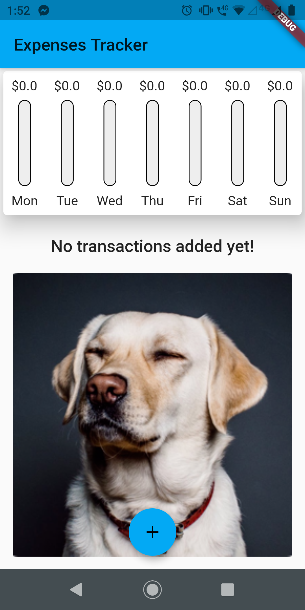
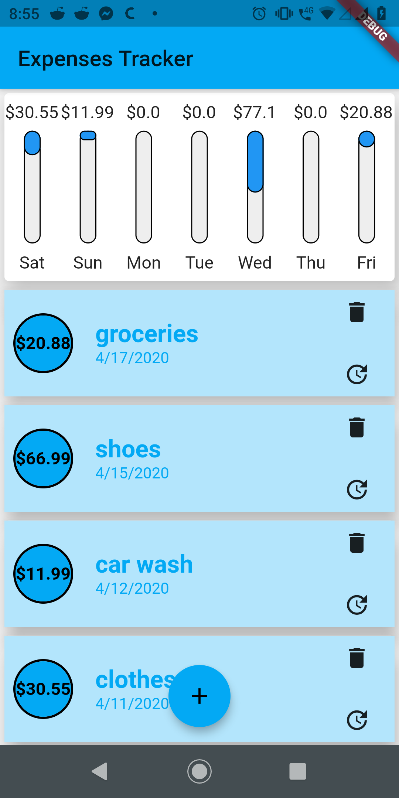

# track_expenses

A new Flutter application.

This is an implementation of a Flutter app that tracks your personal expenses.

## Before adding expenses :

## While adding expenses :

## After adding expenses :

